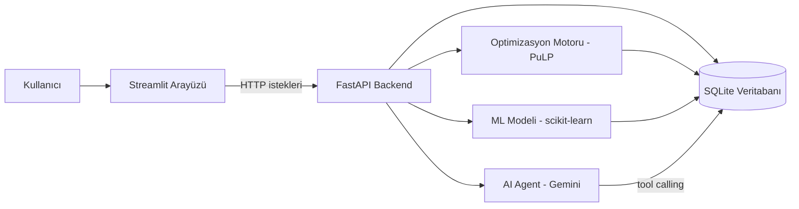
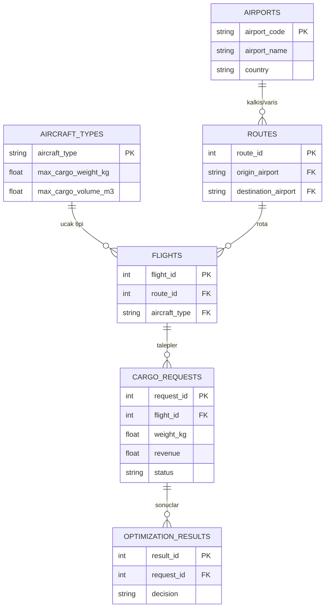
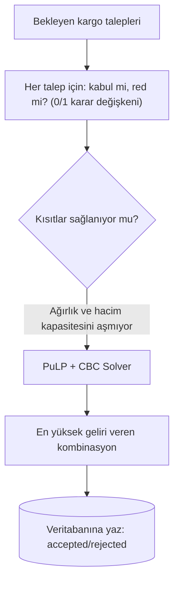
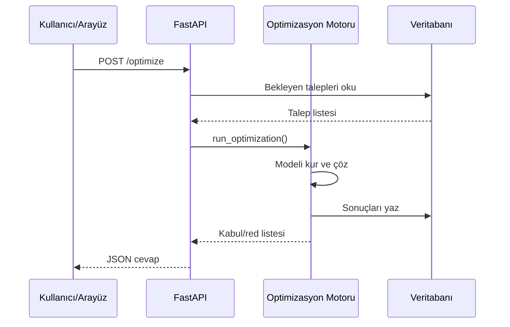
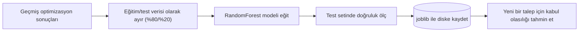
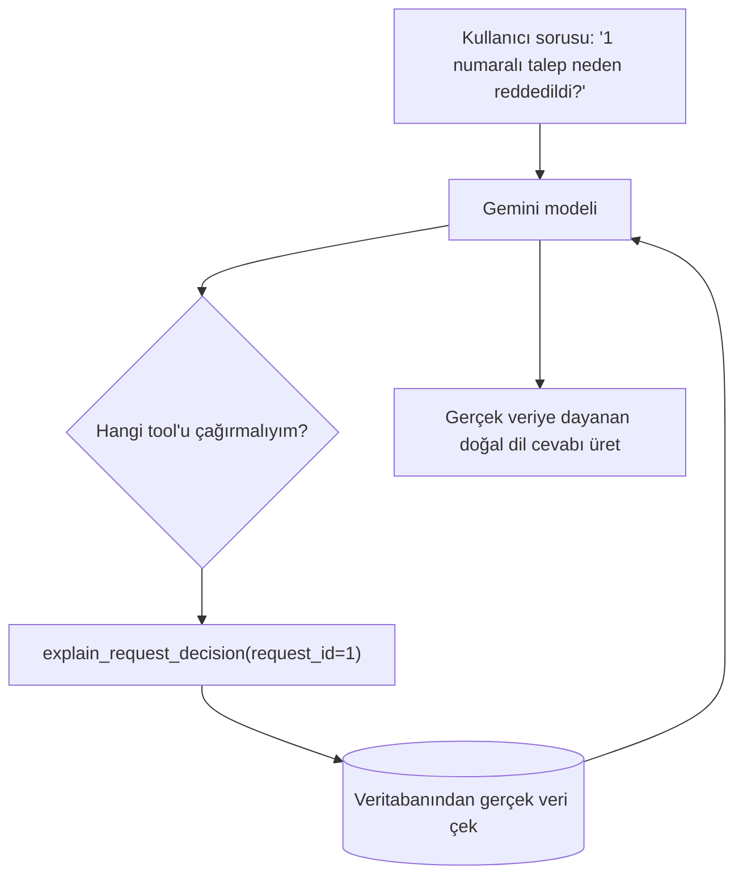
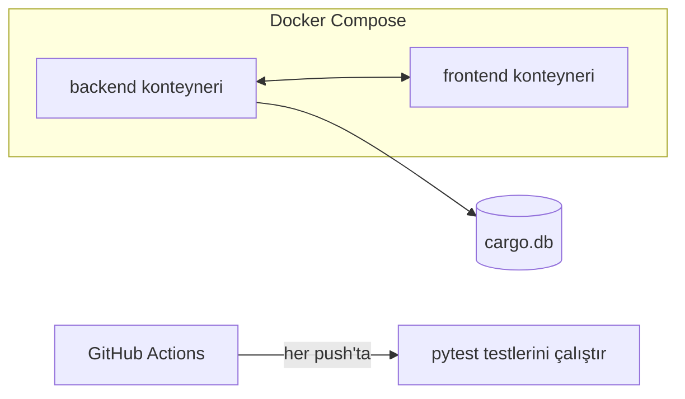

# Proje Yolculuğu: Baştan Sona Ne Yaptık?

Bu doküman, Flight Cargo Optimization & AI Decision Support System projesini sıfırdan bugüne nasıl inşa ettiğimizi, her adımda ne yaptığımızı ve neden yaptığımızı basit bir dille anlatıyor. Amaç, bu projeyi bir mülakatta ya da kendi kendine gözden geçirirken "baştan sona ne oldu" sorusuna rahatça cevap verebilmen.

## Genel Resim

Sonunda elimizde şöyle bir sistem var:

Kullanıcı arayüzden bir şey istediğinde (örn. "optimizasyonu çalıştır"), arayüz backend'e bir HTTP isteği atıyor, backend veritabanından veri okuyup ilgili motoru (optimizasyon, ML veya agent) çalıştırıyor, sonucu tekrar arayüze döndürüyor. Her kutu ayrı bir sorumluluk taşıyor — bu, "separation of concerns" (sorumlulukların ayrılması) dediğimiz temel yazılım prensibi.

## Faz 0: Kurulum ve Temeller

İşe hiç kod yazmadan önce ortamı kurmakla başladık:

- VS Code'a Claude Code kuruldu, terminalin ne olduğunu ve temel komutları (`pwd`, `ls`, `cd`, `mkdir`, `touch`) öğrendin.
- Proje bir git deposu haline getirildi (`git init`), `.gitignore` ile hangi dosyaların asla takip edilmeyeceği tanımlandı (şifreler, sanal ortamlar, veritabanı dosyaları gibi).
- GitHub'da `flight-cargo-optimization-ai-decision-support` adında bir uzak depo (repository) oluşturulup yerel proje oraya bağlandı (`git remote add`, `git push`).

Neden önemli: bir yazılım projesi, versiyon kontrolü olmadan "profesyonel" sayılmaz. Her değişikliğin kaydı tutulur, geri alınabilir, başka biriyle paylaşılabilir.

## Faz 1: Data Layer (Veri Katmanı)

Sistemin hafızasını kurduk — hangi bilgiyi nasıl sakladığımızı tanımladık.

Ne yaptık: SQLAlchemy ile Python class'ları yazdık (`Airport`, `AircraftType`, `Route`, `Flight`, `CargoRequest`), her class bir veritabanı tablosuna karşılık geliyor (buna ORM - Object Relational Mapping deniyor). `seed_data.py` ile sahte ama gerçekçi veri ürettik (havalimanları, uçak tipleri, uçuşlar, kargo talepleri).

Neden önemli: veri, bir kez doğru modellenirse üzerine her şey (optimizasyon, API, arayüz) sağlam kurulur. Yanlış modellenmiş veri, ileride her katmanda tekrar tekrar sorun çıkarır.

## Faz 2: Optimization Engine (Optimizasyon Motoru)

Sistemin "beynini" kurduk — hangi kargo talebinin kabul, hangisinin red edileceğine karar veren matematiksel modeli.

Ne yaptık: her kargo talebi için "kabul et ya da etme" kararını temsil eden bir değişken tanımladık, amaç fonksiyonunu ("toplam geliri maksimize et") ve kısıtları ("her uçuşun ağırlık/hacim kapasitesini aşma") PuLP kütüphanesiyle kurduk, CBC adlı ücretsiz bir çözücü (solver) ile en iyi kombinasyonu bulduk.

Neden önemli: bu, "Operations Research" (yöneylem araştırması) dediğimiz alanın temel uygulaması. Gerçek havayollarının kargo/gelir yönetimi ekiplerinin çözdüğü problemin küçük ama gerçek bir versiyonu.

## Faz 3: Backend API

Optimizasyon motorunu ve veriyi, dışarıdan erişilebilir hale getirdik.

Ne yaptık: FastAPI ile `GET /routes`, `GET /flights`, `GET /cargo-requests`, `POST /optimize` gibi endpointler yazdık. Pydantic ile "API dışarıya ne gösterir" şemalarını (veritabanı modelinden ayrı olarak) tanımladık.

Neden önemli: bir sistemin "beyni" ne kadar iyi olursa olsun, dışarıdan erişilemiyorsa kullanılamaz. API, farklı arayüzlerin (web, mobil, başka sistemler) aynı iş mantığını kullanmasını sağlıyor.

## Faz 4: UI Layer (Arayüz)

Sonuçları görsel, anlaşılır hale getirdik.

Ne yaptık: Streamlit ile KPI kartları (kabul/red sayısı, toplam gelir, solver durumu), kargo talepleri tablosu ve "Optimizasyonu Çalıştır" butonu olan bir arayüz kurduk. Arayüz, backend kodunu import etmiyor — sadece HTTP istekleri atıyor (tıpkı bir web sitesinin bir API'ye istek atması gibi).

Neden önemli: teknik olarak doğru bir sistem, kullanıcı onu göremiyor/kullanamıyorsa değersiz kalır. Arayüz, karar destek sisteminin "vitrini".

## Faz 5: ML Layer (Makine Öğrenmesi)

Geçmiş kararlardan öğrenen bir tahmin katmanı ekledik.

Ne yaptık: `cargo_requests` ve `optimization_results` tablolarını birleştirip (JOIN) geçmiş kararları "etiketli veri" haline getirdik, scikit-learn ile bir RandomForest modeli eğittik, MLflow ile her eğitim denemesini (parametreler, doğruluk skoru) kayıt altına aldık, modeli API üzerinden (`/ml/train`, `/ml/predict`) erişilebilir yaptık.

Neden önemli: optimizasyon motoru geçmişe bakmıyor, sadece o an elindeki taleplere göre karar veriyor. ML katmanı, "bu tarz bir talep genelde kabul mü ediliyor" gibi geçmişten öğrenen bir sinyal ekliyor.

## Faz 6: AI Agent Layer

Sonuçları doğal dille açıklayan, soruları cevaplayan bir yapay zeka asistanı ekledik.

Ne yaptık: Google Gemini API ile "tool calling" (araç çağırma) mimarisi kurduk. Agent'a 4 tane Python fonksiyonu ("tool") verdik, model kullanıcının sorusuna göre hangi fonksiyonu çağıracağına kendisi karar veriyor, fonksiyonun döndürdüğü gerçek veriye dayanarak cevap üretiyor. Bir "guardrail" (koruma kuralı) ile modele "asla veri uydurma, solver'ın kararını değiştirme" talimatını verdik.

Neden önemli: bir optimizasyon sonucunu ("47 talep kabul edildi") görmek başka, "neden bu talep reddedildi" sorusuna anlaşılır bir cevap almak başka. Bu katman, teknik sonucu insan diline çeviriyor.

## Faz 7: Production Layer

Projeyi "biri klonlayıp çalıştırabilir" hale getirdik.

Ne yaptık: her katman için `Dockerfile` yazdık (uygulamanın hangi ortamda nasıl çalışacağının tarifi), `docker-compose.yml` ile backend ve frontend'i birlikte ayağa kaldırdık, pytest ile optimizasyon motorunun matematiksel olarak doğru karar verdiğini doğrulayan testler yazdık, GitHub Actions ile her `git push`ta bu testlerin otomatik çalışmasını sağladık.

Neden önemli: bu faz, projeyi "benim bilgisayarımda çalışıyordu" seviyesinden çıkarıp, başka bir bilgisayarda/sunucuda güvenle çalıştırılabilir hale getiriyor — profesyonel bir yazılım ürününü amatör bir denemeden ayıran tam olarak bu.

## Karşılaştığımız ve Çözdüğümüz Gerçek Sorunlar

Bunlar da öğrenme sürecinin gerçek bir parçası, mülakatta anlatmaya değer:

- **CBC solver "Bad CPU type" hatası** — Apple Silicon Mac'te PuLP'nin paket içi çözücüsü çalışmadı, Homebrew ile sistem seviyesinde CBC kurup koda "önce sistemdekini dene" mantığı ekledik.
- **"no such table" hatası** — yeni bir model (`OptimizationResult`) eklendiğinde bazı giriş noktaları bundan haberdar olmadı, tüm modelleri merkezi bir `__init__.py`'de toplayarak çözdük.
- **Gemini model adı değişiklikleri** — `gemini-1.5-flash` ve `gemini-2.5-flash` kullanımdan kaldırılmıştı, güncel modele (`gemini-3.1-flash-lite`) geçtik.
- **Port çakışmaları** — birden fazla `uvicorn`/`streamlit` süreci aynı anda çalışınca port hataları aldık, `lsof` ve `kill` ile süreç yönetimini öğrendik.

## Sırada Ne Var

MVP (en yalın uçtan uca versiyon) tamamlandı. Derinleştirme turunda ele alınabilecekler: AI Agent'a hafıza ve gerçek RAG eklemek, optimizasyon modeline ek kısıtlar (soğuk zincir, embargo, öncelik sınıfı) koymak, PostgreSQL'e geçiş, daha kapsamlı ML özellikleri ve testleri.
